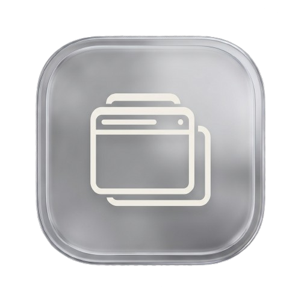

  

<h1 align="center">YT AlwaysOnTop</h1>

  <strong>Truly edgeless, Always-on-Top Picture-in-Picture for YouTube. Work while you watch!</strong>

  Made with ❤️ by <a href="https://x.com/snc0x"><strong><u>snc0x</u></strong></a>

  

---

YT AlwaysOnTop is a minimalist Chrome extension designed for maximum productivity. It transforms the standard YouTube experience into a floating, borderless window that stays on top of all other applications.

## ✨ Features

- **🚀 Truly Edgeless**: No title bars, no borders, no distractions. Just your video.
- **📌 Always on Top**: Stays pinned above all other windows (Browsers, IDEs, Slack, etc.).
- **🔄 Auto-Launch**: Automatically pops the video out when you switch tabs or start a new video.
- **⚡ Hotkey Support**: Toggle the mode instantly with `Alt + P`.
- **🎨 Native UI**: Injected button blends perfectly with YouTube's official player controls.
- **🔒 Quality Lock**: Automatically maintains high-definition playback in floating mode.

## 🛠️ Installation

### Developer Mode (Manual)
1. Download this repository as a ZIP and extract it.
2. Open Chrome and go to `chrome://extensions/`.
3. Enable **Developer mode** (top right toggle).
4. Click **Load unpacked** and select the folder you extracted.

## ⌨️ Shortcuts

| Action | Shortcut |
| :--- | :--- |
| **Toggle PiP** | `Alt + P` |

---

  *Made with ❤️ by <a href="https://x.com/snc0x"><strong><u>snc0x</u></strong></a>*

